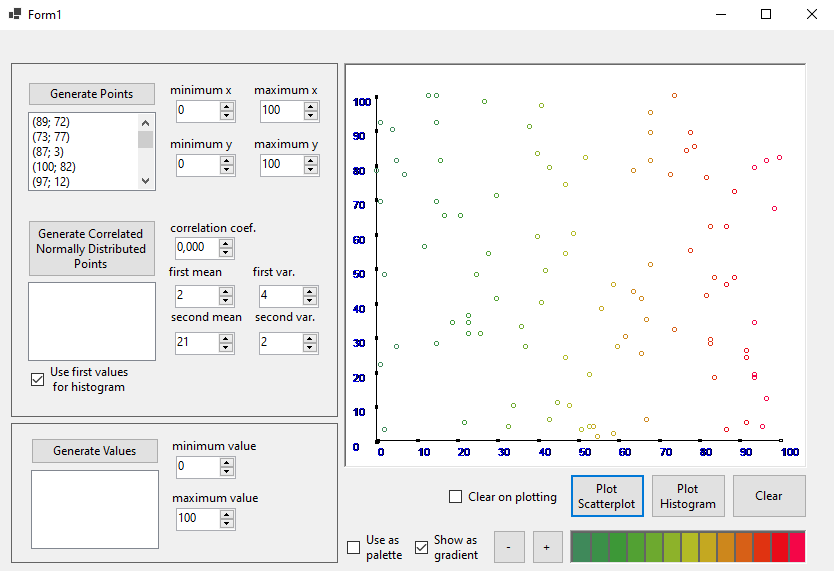
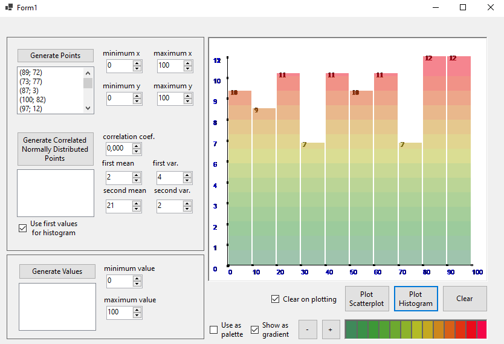
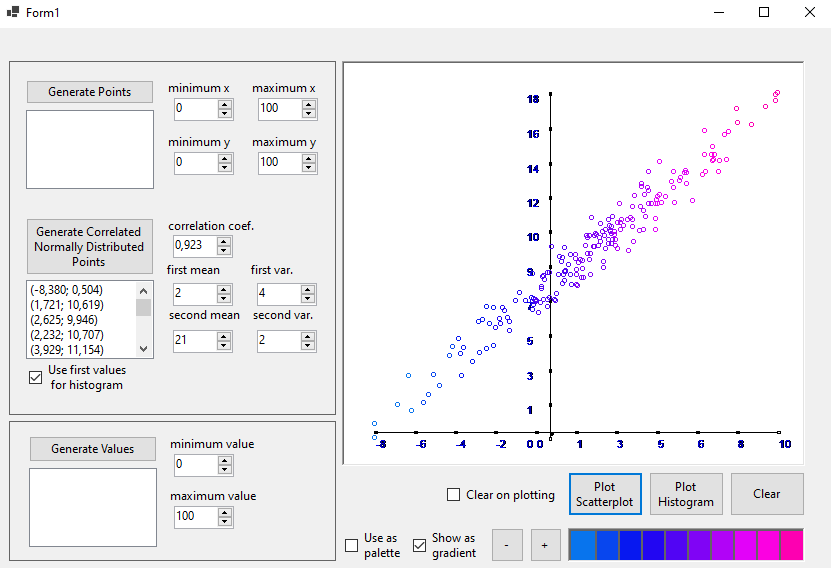
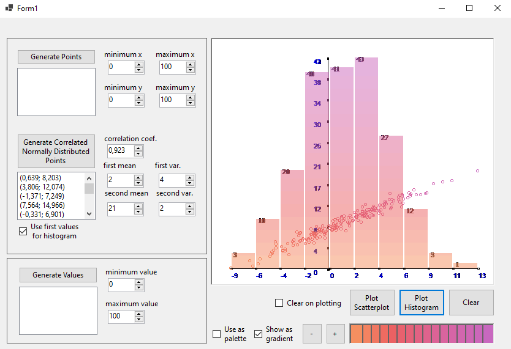

# HistogramScatterplot_NET_Demo
Реализация компонента визуализации данных для .NET, поддерживающего гистограммы и диаграммы рассеяния.

Пользовательский элемент графического интерфейса "PlotView" инкапсулирует операции отрисовки графика. Пользователю достаточно передать в качестве параметров данные, тип окраски и цвета.

Элемент поддерживает три типа окраски (однотонная, палитра, градиент), и два типа графиков: диаграммы рассеяния и гистограммы. Диаграммы можно накладывать друг на друга.

## Примеры визуализации

